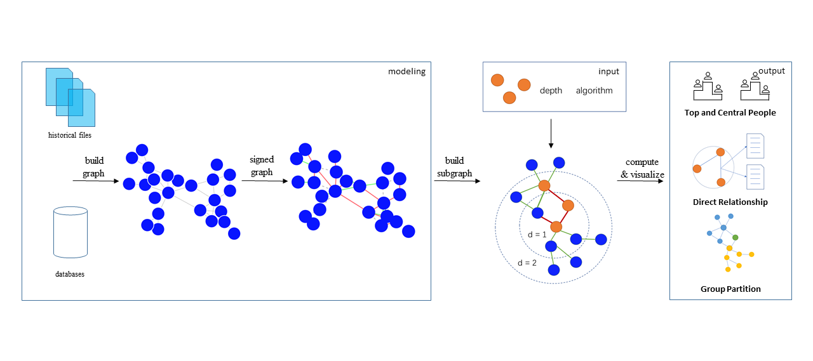

# Computing Len for Exploring the Historical People's Social Network

## [Demo Online](http://h12345jack.github.io/CLHPSoNet)

Here is demo for Eight Great Prose Masters of the Song, which is just frontend UI without server.

## System setup

### Python3.5
```
pip install -r requirements.txt
```

### Node9

```
git checkout -b frontend origin/frontend
npm install 
npm run start
```

## Data collection

using [cbdb api](https://projects.iq.harvard.edu/cbdb/cbdb-api) to get datas, you can use get_datas.py to collect data. and mv data to ```./datas/datas```

```
python get_datas.py
```

## CLHPSoNet Workflow


> It includes signed graph modeling, subgraph extraction, computing and visualize. The final output is consists of three parts: Top and Central People, Direct Relationship and Group Partition. 


<!-- Average Clustering Coefficient: 0.331
Total triangles: 15441

Diameter: 13
Radius: 0
Average Path length: 4.080560740058098 -->

<!-- #### 宋 song
clustering_coefficient 0.12060757693469124
宋 largest connected subgraph
clustering_coefficient 0.12431603903299564
Name:
Type: SubGraph
Number of nodes: 16456
Number of edges: 29935
Average degree:   3.6382
average_shortest_path_length 4.08057192410704

#### 元 yuan
clustering_coefficient 0.14983122151329337
元 largest connected subgraph
clustering_coefficient 0.1555130902757531
Name:
Type: SubGraph
Number of nodes: 6170
Number of edges: 11718
Average degree:   3.7984
average_shortest_path_length 4.00785702969808

#### 明 ming
clustering_coefficient 0.069994000427896
明 largest connected subgraph
clustering_coefficient 0.07302196355808184
Name:
Type: SubGraph
Number of nodes: 7933
Number of edges: 14354
Average degree:   3.6188
average_shortest_path_length 4.655342915729116

#### 清 qing
clustering_coefficient 0.020977940688046957
清 largest connected subgraph
clustering_coefficient 0.029628018560158693
Name:
Type: SubGraph
Number of nodes: 2001
Number of edges: 2295
Average degree:   2.2939
average_shortest_path_length 7.7171639180409795

> networkx makes the clustering coefficient to be 0 for nodes with degree less than 2 and averages over all the nodes. While Gephi doesn't count the nodes at all that are having degree less than 2 and computes average clustering only for nodes with degree >= 2

[gephi和networkx结果不同的原因](https://stackoverflow.com/questions/41926514/average-clustering-coefficient-for-graph) -->

## Citation

```
coming soon

```


